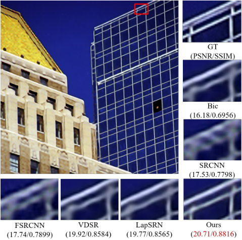
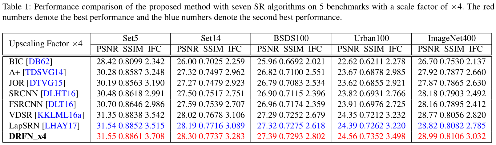
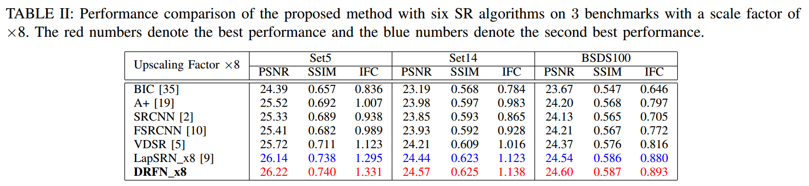
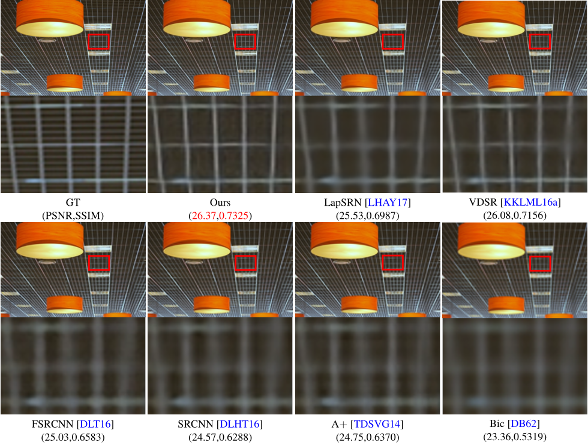
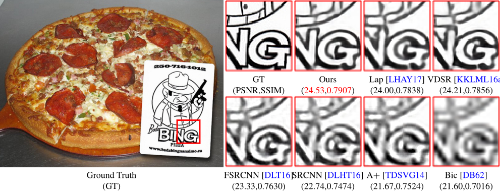
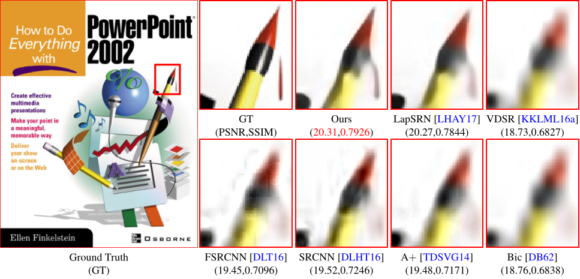
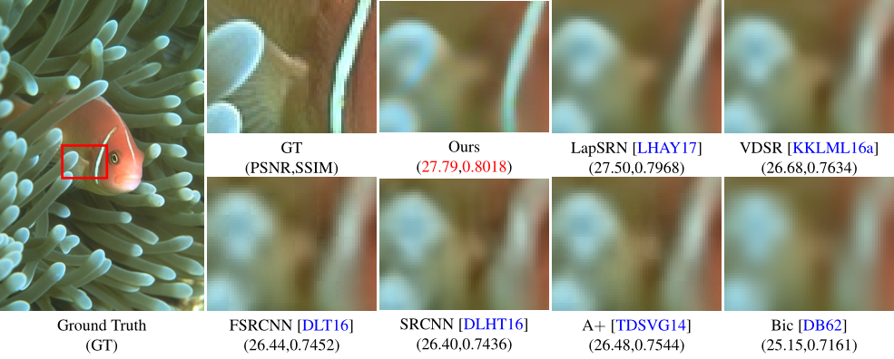

# DRFN
CAFFE implementation of "**DRFN: Deep Recurrent Fusion Network for Single Image Super-Resolution with Large Factors**" by Xin *et al*.

<<<<<<< HEAD
# Compare with state-of-the-art

=======
>>>>>>> parent of a7500a7... table

# Visual Comparison
## Scale factor x4

## Scale factor x8

# License
* For academic and non-commercial use only.
* For commercial use,please contact [mhy845879017@gmail.com](https://www.google.com/gmail/).
